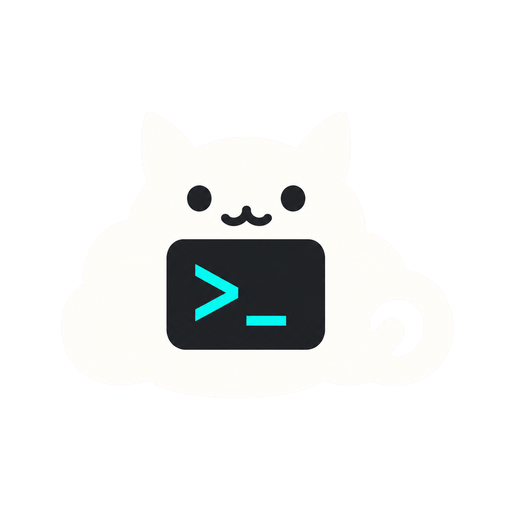

# Codex Pet Desktop

<p align="center">
  
</p>

<p align="center">
  A private-by-default, noncommercial Windows desktop pet that reacts to local Codex activity.
</p>

<p align="center">
  <a href="README.zh-CN.md">简体中文</a> ·
  <a href="https://github.com/zxy19960316/codex-pet-desktop/releases/latest">Download</a> ·
  <a href="CHANGELOG.md">Changelog</a> ·
  <a href="CONTRIBUTING.md">Contributing</a>
</p>

Codex Pet Desktop is an independent, source-available Electron companion for Codex on Windows. It
stays on the desktop, changes animation with active tasks, and shows local session status, quota,
and token usage without uploading session content.

> **Noncommercial license:** v1.1.0 source code and bundled original assets are available under the
> [PolyForm Noncommercial License 1.0.0](LICENSE). You may use, study, modify, and share them for
> permitted noncommercial purposes. General commercial use is not licensed. This is source-available
> software, not OSI-approved open source. The already-published v1.0.0 release remains under the MIT
> terms that accompanied that release.

## Highlights

- Twelve normalized pet states: `idle`, `thinking`, `typing`, `working`, `approval`,
  `waiting_input`, `success`, `error`, `quota_low`, `quota_empty`, `offline`, and `sleep`.
- A compact battle HUD that follows the pet and shows the active model, reasoning effort, available
  `5H` and `WEEKLY` quota bars, plus current-turn tokens versus the model context window.
- Left-click session quick view and a detailed Chinese session Hub with recent state, elapsed time,
  activity, project label, quota, and direct access to Settings Center.
- Pixel-shaped Windows hit testing: transparent space around the sprite does not block mouse input.
- 50–200% pet scaling, Ctrl+mouse-wheel resizing, multi-display bounds handling, always-on-top and
  click-through options.
- A real tray application with an original cloud-cat terminal icon, Chinese Settings Center, optional
  launch at Windows sign-in, and normal operation after the launching terminal is closed.
- Local-only pet packages with PNG/WebP validation, state fallbacks, preview, switching, and an
  atomic directory importer.
- Optional local Codex lifecycle hooks and App Server controls. Existing hooks are preserved and
  Codex's trust review is never bypassed.

## Install on Windows

Requirements: Windows 10 or 11 (x64) and a local Codex installation.

1. Open the [latest release](https://github.com/zxy19960316/codex-pet-desktop/releases/latest).
2. Download `codex-pet-desktop-1.1.0-setup-x64.exe` and its `.sha256` file.
3. Optionally verify the download in PowerShell:

   ```powershell
   Get-FileHash .\codex-pet-desktop-1.1.0-setup-x64.exe -Algorithm SHA256
   Get-Content .\codex-pet-desktop-1.1.0-setup-x64.exe.sha256
   ```

4. Run the installer and start **Codex Pet Desktop** from the Start menu or desktop shortcut.

The v1.1.0 installer is not code-signed, so Microsoft Defender SmartScreen may display an
unrecognized-app warning. Verify the checksum and source before choosing to run it. Uninstalling
the application keeps your imported pet packages and settings by default.

## First use

1. Start Codex Pet Desktop. The pet and status card appear near the lower-right corner.
2. Left-click the pet to toggle the compact current-session view. Right-click the pet to open the
   detailed session Hub. Right-click the tray icon for the application menu and Settings Center.
3. In the session Hub, review recent normalized sessions, activity time, quota, and token usage; use
   **Open Settings Center** for all options.
4. Under **General**, enable **Launch at Windows sign-in** if desired. Change pet size, always-on-top,
   cross-display scaling, or click-through behavior there.
5. Under **Codex connection**, leave **Start App Server automatically** enabled for automatic quota
   and control integration, or disable it for lifecycle-only operation.
6. Use **Connect Codex activity** from the menu if lifecycle hooks are not installed. Then open
   `/hooks` in Codex, review the commands, and explicitly trust them.
7. Start or focus a Codex task. The app follows recent session files from today or yesterday and
   updates model, reasoning effort, tokens, rate limits, and animation state locally.

If no current `5H` or `WEEKLY` limit exists, that row is omitted instead of inventing a value.
Closing a terminal does not close an installed app; choose **Quit** from the tray menu to exit.

## Pet packages and asset integration

The installer includes only **Pixel Sprout**, an original procedural pet licensed with this
repository for noncommercial use. No local Pokémon, Codex PokéPets, or other third-party character
art is bundled. To use artwork that you have the right to use locally:

1. Create a directory containing `manifest.json`, a PNG/WebP preview, and one or more PNG/WebP
   sprite sheets.
2. Provide at least the `idle` animation; add any or all of the twelve states for richer behavior.
3. Open **Settings Center → Pets → Import package** and select the directory.
4. Review the imported entry and make it active. Imported files are copied to the application's
   per-user data directory, never into this Git repository.

See the [visitor asset-authoring guide](docs/guides/PET_ASSET_AUTHORING.md) for a complete example,
geometry rules, size limits, twelve-state mapping, validation, and local conversion workflow. The
lower-level [Pet Package System](docs/guides/PET_PACKAGE_SYSTEM.md) documents the runtime contract.
Compatible already-installed Codex PokéPets can be adapted one at a time using the
[local import guide](docs/guides/CODEX_POKEPETS_IMPORT.md).

Do not upload, attach to a Release, or open a pull request containing Pokémon artwork, extracted
game resources, or another creator's assets unless the rights holder explicitly permits that
redistribution. Editing an asset locally and adding a “noncommercial” notice does not grant
redistribution rights. Read [ASSET_POLICY.md](ASSET_POLICY.md) before sharing a pet package.

## Privacy and security

- No account, telemetry uploader, browser-cookie access, cloud settings sync, or login emulation.
- The session monitor tails a bounded set of recent local Codex JSONL files and extracts only
  timestamps, safe session/turn identifiers, lifecycle event types, model name, reasoning effort,
  token counts, context-window size, and rate-limit metadata needed for normalized UI state.
- Lifecycle hook output retains only session ID, turn ID, event name, and timestamp. Prompt text,
  transcripts, tool inputs, and tool outputs are not stored by the app.
- Settings, hook events, and imported pets remain in Electron's local per-user application data.
- Renderer processes are sandboxed and receive validated data through typed IPC.

Never attach your session files, local logs, settings directory, or imported proprietary artwork to
a bug report. Security reports should follow [SECURITY.md](SECURITY.md).

## Build from source

Requirements: Windows 10/11, Node.js 24 LTS, npm 11, and Git.

```powershell
git clone https://github.com/zxy19960316/codex-pet-desktop.git
cd codex-pet-desktop
npm ci
npm run dev
```

Quality and packaging commands:

```powershell
npm run format:check
npm run lint
npm test
npm run build
npm run package:dir
npm run package:installer
```

`package:dir` creates an ignored unpacked app under `release/`. `package:installer` creates an
ignored unsigned x64 NSIS installer and checksum under `release/m3-3/`. Maintainers can run the
heavier `npm run verify:m3-2` and `npm run verify:m3-3` packaged lifecycle checks.

## Versioning and contributing

Releases follow Semantic Versioning. Source, tag, installer version, changelog entry, and GitHub
Release must share one version. See [VERSIONING.md](VERSIONING.md) for the branch/tag/release policy
and [CONTRIBUTING.md](CONTRIBUTING.md) for development rules.

## Independence and license

Codex Pet Desktop v1.1.0 source code and bundled original assets use
`PolyForm-Noncommercial-1.0.0`. Personal study, research, education, public-interest work, hobby
projects, modification, and redistribution are allowed only to the extent permitted by the full
[LICENSE](LICENSE). Selling the app, incorporating it into a commercial product or paid service,
or otherwise using it for a commercial purpose is not licensed without separate written permission
from the copyright holders. Dependencies and third-party imports retain their own licenses.

Because commercial use is restricted, v1.1.0 is accurately described as **source-available**, not
OSI-approved open source. The restriction applies to v1.1.0 and later releases carrying this
license; it does not revoke the MIT license already granted with v1.0.0.

This project is not affiliated with or endorsed by OpenAI, Nintendo, Game Freak, Creatures Inc.,
The Pokémon Company, Clawd on Desk, AgentPet, or Codex PokéPets. No source code or artwork from
those projects is copied into this repository or public installer.
