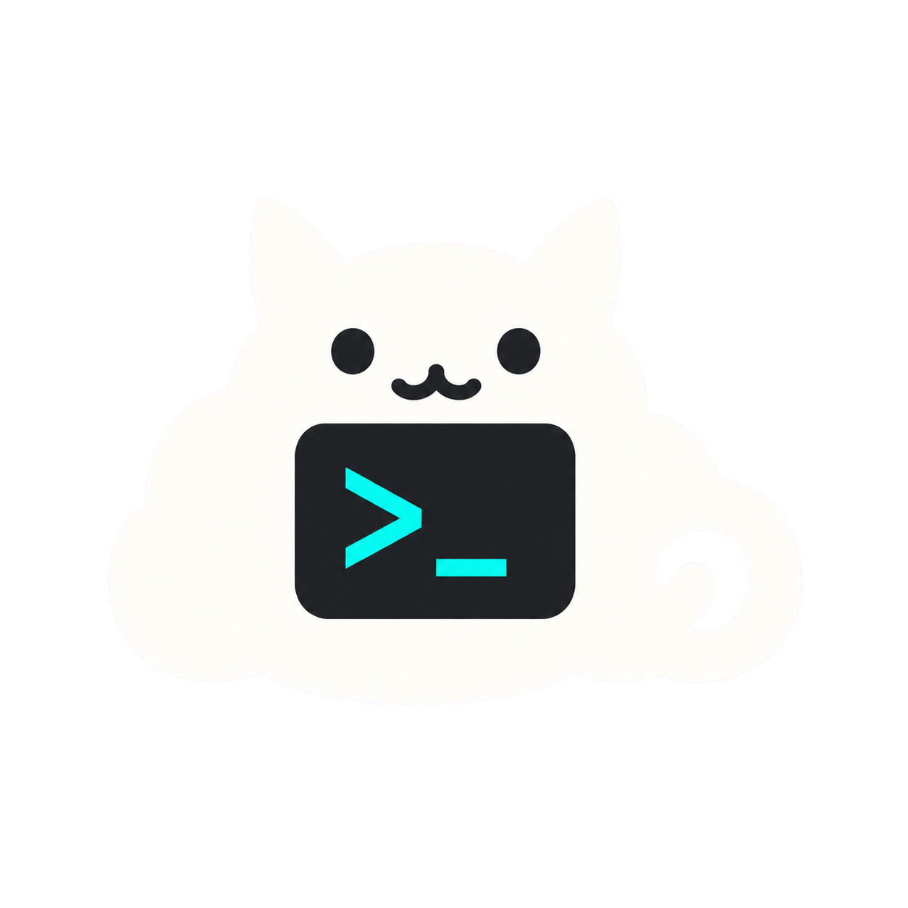

# Codex Pet Desktop

<p align="center">
  
</p>

<p align="center">
  一个默认保护隐私、会随本地 Codex 活动变化的 Windows 桌面宠物。
</p>

<p align="center">
  <a href="README.md">English</a> ·
  <a href="https://github.com/zxy19960316/codex-pet-desktop/releases/latest">下载最新版</a> ·
  <a href="CHANGELOG.md">更新记录</a> ·
  <a href="CONTRIBUTING.md">参与开发</a>
</p>

Codex Pet Desktop 是独立开发的开源 Electron 桌宠。它会自动跟随最新的本地 Codex 会话，
根据任务状态切换动画，并在宠物头顶显示游戏对战风格的模型、思考强度、额度和 Token 信息，
无需手动选择 Agent。

## 主要功能

- 支持 `idle`、`thinking`、`typing`、`working`、`approval`、`waiting_input`、
  `success`、`error`、`quota_low`、`quota_empty`、`offline`、`sleep` 共 12 种状态。
- 跟随宠物移动的紧凑状态栏：显示当前模型、思考强度、可用的 `5H`/`WEEKLY` 额度，以及
  当前轮 Token / 模型上下文窗口。
- Windows 像素级窗口形状：宠物周围的透明区域不会遮挡鼠标点击。
- 支持 50–200% 缩放、Ctrl+滚轮调整、多显示器、置顶和鼠标穿透。
- 正式托盘应用、原创云朵猫终端图标、设置中心、登录 Windows 时自启动；关闭启动终端后
  已安装的程序仍会继续运行。
- 支持本地 PNG/WebP 宠物包导入、校验、状态回退、预览、切换和安全复制。
- 可选 Codex 生命周期 Hook 与 App Server 连接；不会跳过 Codex 自身的信任确认。

## Windows 安装

要求：Windows 10/11 x64，电脑上已安装本地 Codex。

1. 打开 [最新 Release](https://github.com/zxy19960316/codex-pet-desktop/releases/latest)。
2. 下载 `codex-pet-desktop-1.0.0-setup-x64.exe` 和对应的 `.sha256` 文件。
3. 可在 PowerShell 中核对文件：

   ```powershell
   Get-FileHash .\codex-pet-desktop-1.0.0-setup-x64.exe -Algorithm SHA256
   Get-Content .\codex-pet-desktop-1.0.0-setup-x64.exe.sha256
   ```

4. 运行安装包，从开始菜单或桌面快捷方式启动 **Codex Pet Desktop**。

v1.0.0 安装包暂未进行代码签名，因此 Microsoft Defender SmartScreen 可能提示“无法识别的
应用”。请先核对校验值和源码，再决定是否运行。卸载程序默认保留设置和已导入宠物。

## 首次使用

1. 启动后，宠物和状态栏会出现在屏幕右下方附近。
2. 右键宠物或托盘图标打开菜单；进入 **Settings Center** 可调整全部选项。
3. 在 **General** 中可开启 **Launch at Windows sign-in**，并调整大小、置顶、跨屏缩放、
   鼠标穿透。
4. 在 **Codex connection** 中保留 **Start App Server automatically**，即可自动连接额度和
   本地控制；关闭后仍可只使用生命周期状态。
5. 如果生命周期 Hook 尚未安装，从菜单选择 **Connect Codex activity**；随后在 Codex 中
   打开 `/hooks`，检查命令并主动选择信任。
6. 打开或切换 Codex 任务。应用会跟随今天或昨天最新的会话文件，在本地更新模型、思考
   强度、Token、额度和动画状态。

如果当前账号没有 `5H` 或 `WEEKLY` 限制，对应条目不会伪造显示。要彻底关闭程序，请从托盘
菜单选择 **Quit**。

## 接入自己的宠物素材

安装包只包含原创程序化像素宠物 **Pixel Sprout**。接入自己的素材：

1. 创建一个含 `manifest.json`、PNG/WebP 预览图和 PNG/WebP 精灵图的文件夹。
2. 至少提供 `idle` 动画；可以补齐全部 12 状态以获得完整效果。
3. 打开 **Settings Center → Pets → Import package**，选择该文件夹。
4. 检查导入结果并设为当前宠物。文件只会复制到应用的用户数据目录，不会进入 Git 仓库。

完整目录结构、清单示例、尺寸限制、12 状态映射和本地制作流程见
[宠物素材制作与接入指南](docs/guides/PET_ASSET_AUTHORING.md)。底层格式见
[Pet Package System](docs/guides/PET_PACKAGE_SYSTEM.md)。已经合法保存在本机的兼容 Codex
PokéPets 可按[本地导入指南](docs/guides/CODEX_POKEPETS_IMPORT.md)逐个转换。

请勿向仓库或 Release 上传 Pokémon 原画、游戏提取资源或无再分发许可的第三方素材。本地
导入不会改变素材的版权与许可归属，分享前请阅读 [ASSET_POLICY.md](ASSET_POLICY.md)。

## 隐私

- 没有云端账号、遥测上传、浏览器 Cookie 读取、云设置同步或登录模拟。
- 会话监视器只从最新的本地 Codex JSONL 会话中提取状态栏需要的模型名、思考强度、
  Token 数、上下文窗口和额度元数据。
- 生命周期 Hook 输出只保留会话 ID、轮次 ID、事件名和时间；应用不会保存提示词、对话、
  工具输入或工具输出。
- 设置、Hook 事件和导入宠物都留在本机用户数据目录。

不要在 Issue 中上传会话文件、本地日志、设置目录或专有素材。安全问题见
[SECURITY.md](SECURITY.md)。

## 从源码运行

要求：Windows 10/11、Node.js 24 LTS、npm 11 和 Git。

```powershell
git clone https://github.com/zxy19960316/codex-pet-desktop.git
cd codex-pet-desktop
npm ci
npm run dev
```

```powershell
npm run format:check
npm run lint
npm test
npm run build
npm run package:installer
```

版本发布遵循 Semantic Versioning。详细规则见 [VERSIONING.md](VERSIONING.md)，贡献流程见
[CONTRIBUTING.md](CONTRIBUTING.md)。源码和仓库内原创素材采用 MIT 许可；本项目与 OpenAI、
Nintendo、Game Freak、Creatures Inc.、The Pokémon Company、Clawd on Desk、AgentPet 或
Codex PokéPets 均无隶属或背书关系。
